# Screenshots

## General

| Page | Description | Screenshot |
| :--- | :--- | :--- |
| **Home Page** | Application home page allowing access to different portals. | 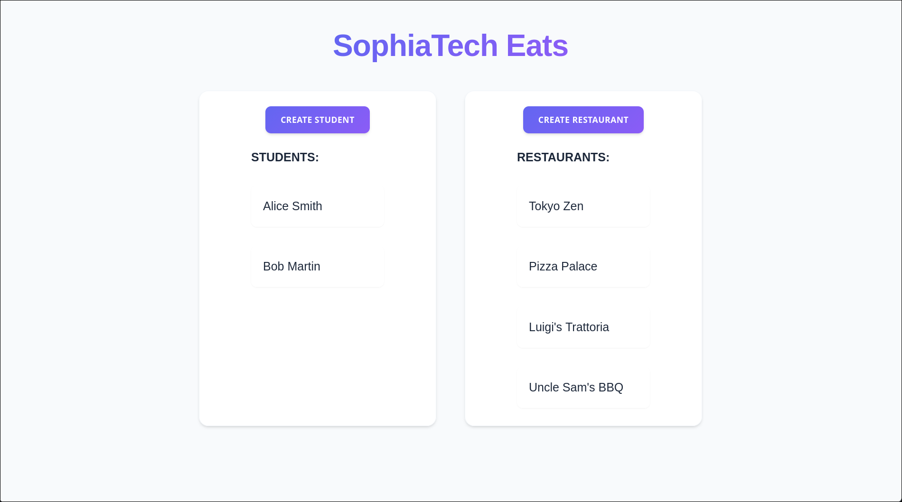 |

## Student

| Page | Description | Screenshot |
| :--- | :--- | :--- |
| **Student Home** | Main interface for students, displaying the list of available restaurants. | 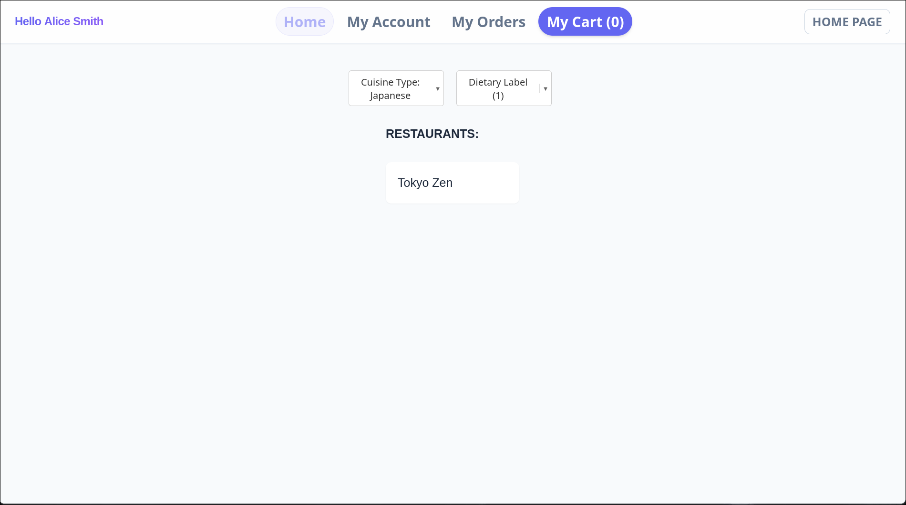 |
| **Personal Information** | Student profile management and payment information page. | 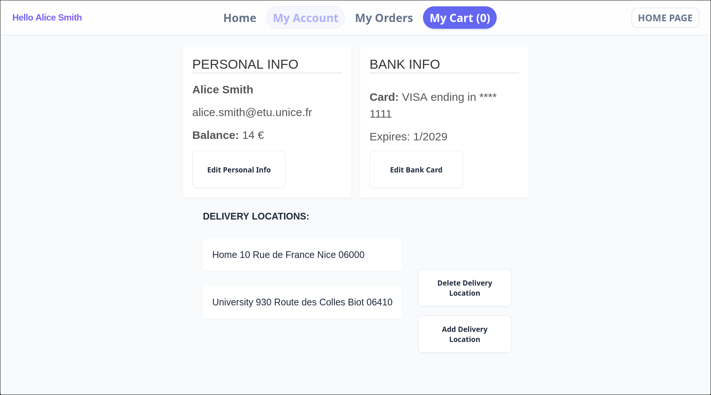 |
| **Order History** | List of orders placed by the student with their status. | 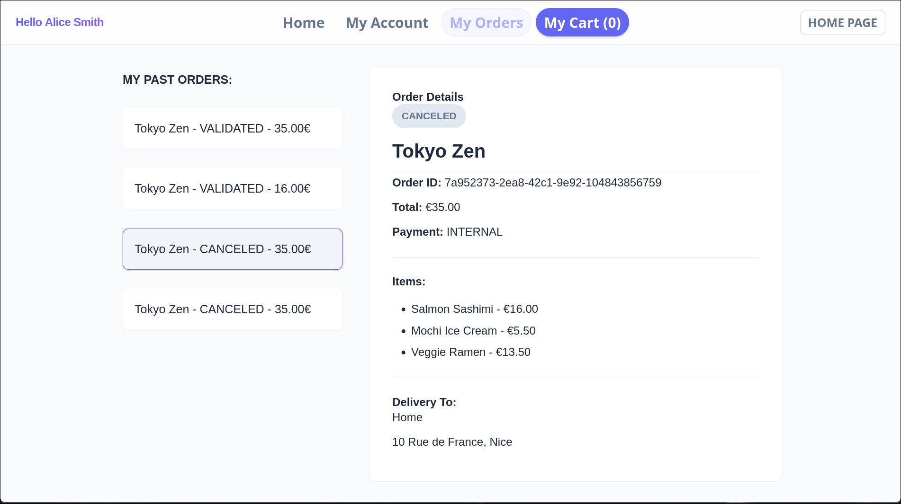 |
| **Dish Details** | Modal window displaying details and options for a specific dish. | 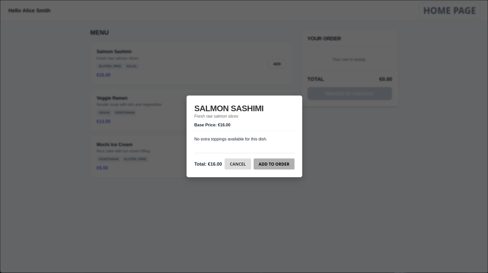 |
| **Checkout** | Cart validation and delivery slot selection page. | 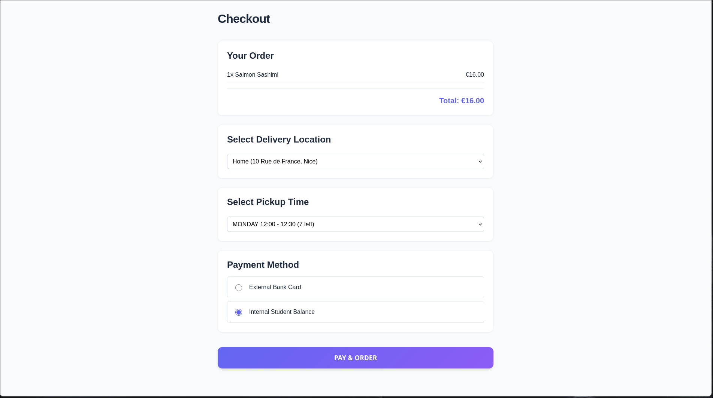 |

## Restaurant

| Page | Description | Screenshot |
| :--- | :--- | :--- |
| **Dashboard** | Overview of restaurant activities. | 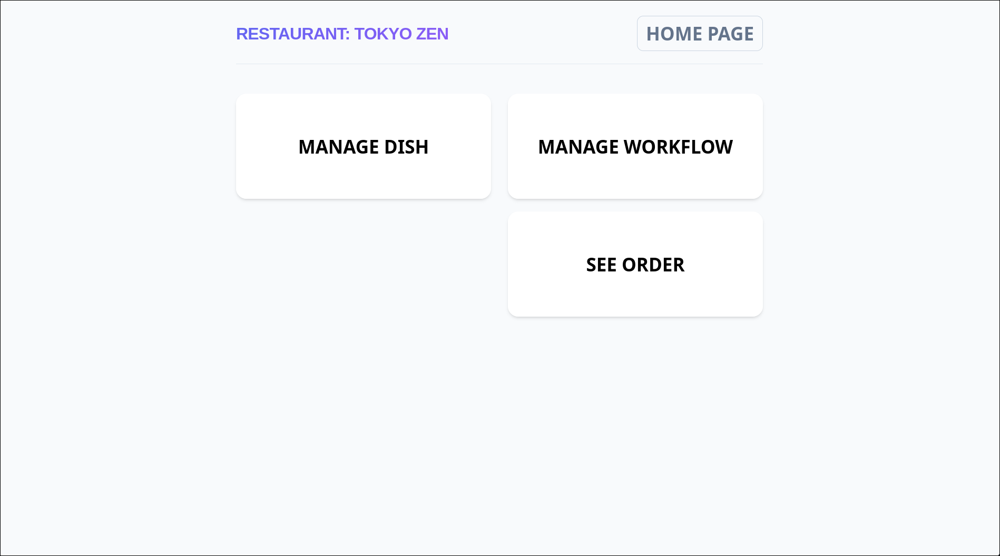 |
| **Order Management** | Interface to view and process incoming orders. | 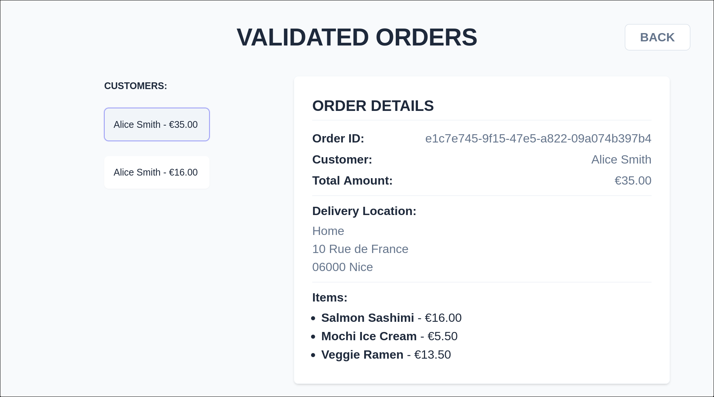 |
| **Menu Management** | List of dishes offered by the restaurant with modification options. | 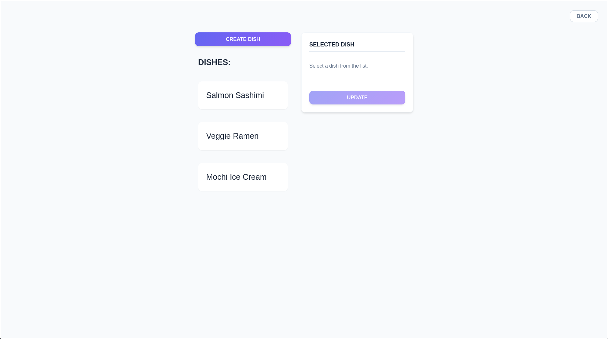 |
| **Create Dish** | Form to add a new dish to the menu. | 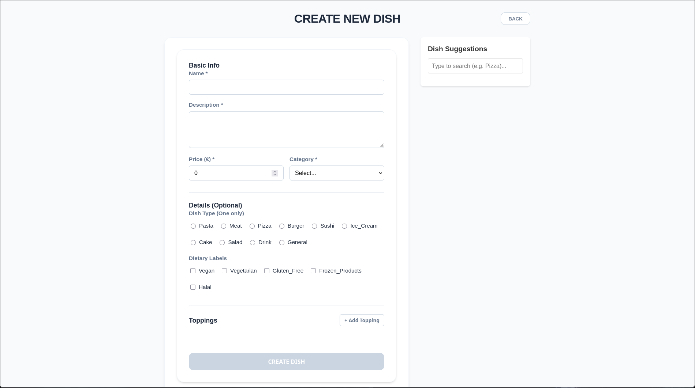 |
| **Time Slots** | Configuration of availability and delivery capacities. | 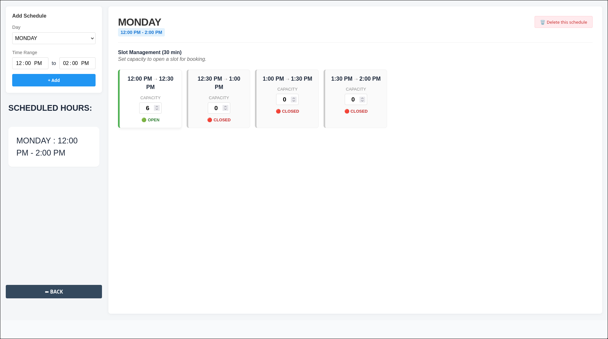 |
